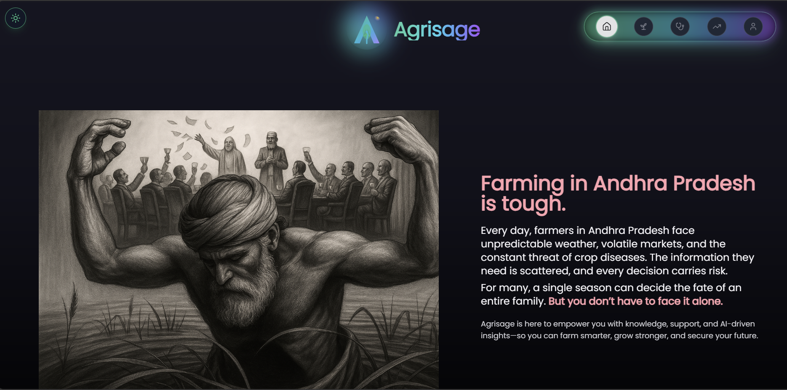
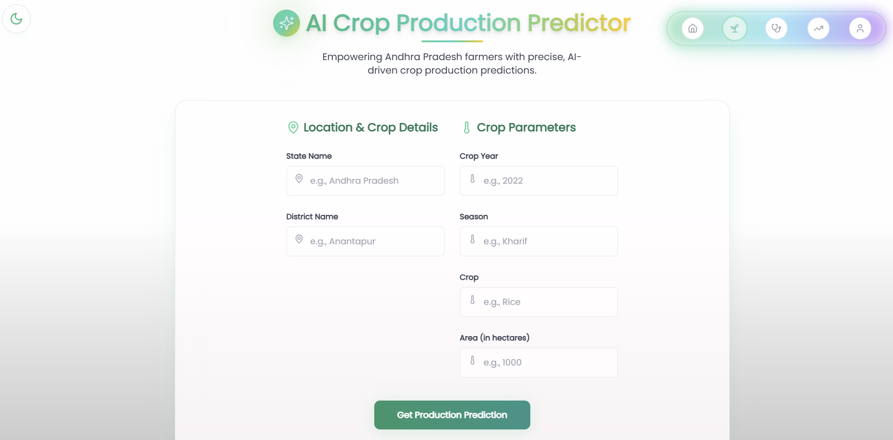
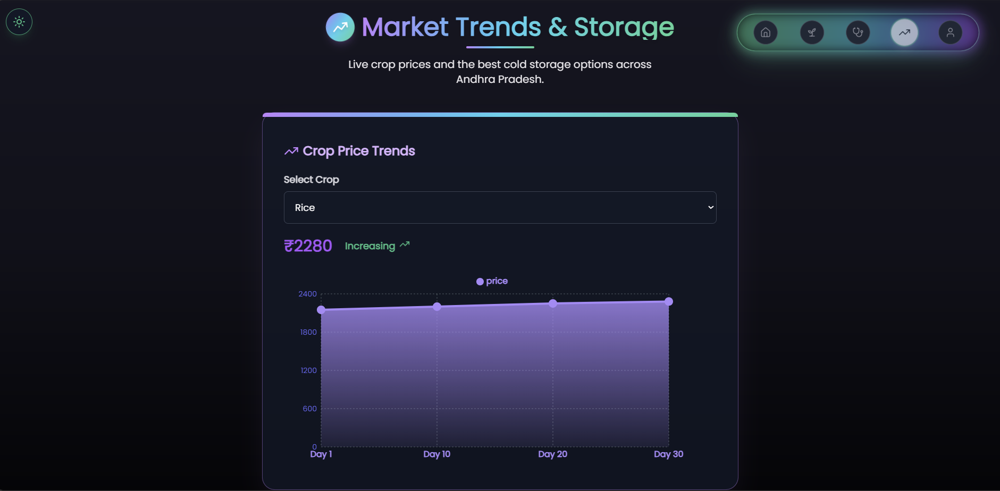
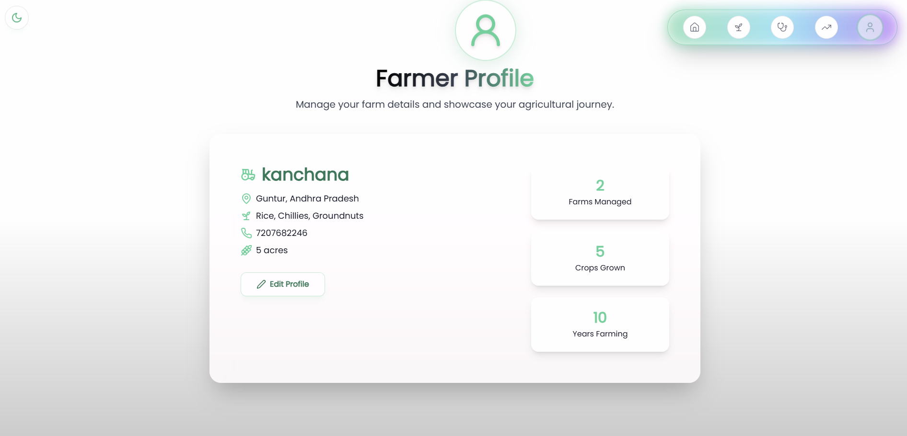
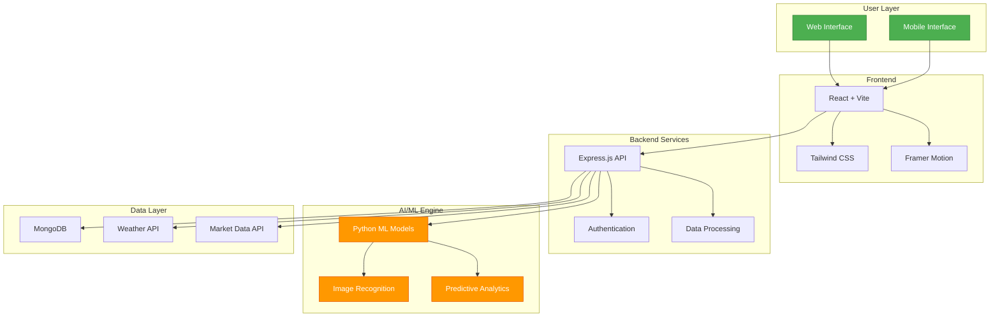

# 🌾 AgriSage
### *Revolutionizing Agriculture in Andhra Pradesh with AI Intelligence*

<div align="center">

<h1>🌾 AgriSage | AI-Powered Farming Revolution 🚀</h1>

```
    _____                .__  _________                     
   /  _  \   ___________|__|/   _____/_____     ____   ____  
  /  /_\  \ / ___\_  __ \  |\_____  \\____ \   / ___\_/ __ \ 
 /    |    / /_/  >  | \/  |/        \  |_> > / /_/  >  ___/ 
 \____|__  \___  /|__|  |__/_______  /   __/  \___  / \___  >
         \/____/                   \/|__|    /_____/      \/ 
```

[](https://choosealicense.com/licenses/mit/)
[](https://reactjs.org/)
[](https://nodejs.org/)
[](https://python.org/)
[](https://mongodb.com/)

<br/>

### 🎬 **[Watch AgriSage Demo →](https://www.linkedin.com/posts/guna-byraju_agritech-aiforgood-smartfarming-activity-7354095699052933121-sH5b?utm_source=share&utm_medium=member_desktop)**
*See the complete platform walkthrough and real-world implementation*

<br/>

**[📖 Documentation](https://docs.agrisage.com)** • **[🐛 Report Bug](https://github.com/yourusername/agrisage/issues)** • **[✨ Request Feature](https://github.com/yourusername/agrisage/issues)**

</div>

---

## 🌟 What is AgriSage?

AgriSage is a **cutting-edge AI platform** specifically designed for farmers in Andhra Pradesh, transforming traditional agriculture into smart, data-driven farming. By leveraging machine learning, real-time weather data, and market intelligence, we empower farmers to make informed decisions that maximize yield, minimize risk, and ensure sustainable growth.

<div align="center">

> ### *"From seed to harvest, AgriSage is your intelligent farming companion"*

</div>

### 🎯 Our Mission
To bridge the gap between traditional farming wisdom and modern technology, making precision agriculture accessible to every farmer in Andhra Pradesh.

---

## ✨ Core Features

<div align="center">

| 🤖 **AI Crop Yield Predictor** | 🔬 **Plant Health Intelligence** | 💧 **Smart Water Management** |
|:---:|:---:|:---:|
| Advanced ML algorithms analyze soil, weather, and historical data | Real-time disease detection with 95%+ accuracy | IoT-integrated irrigation recommendations |
| Accurate predictions for 15+ major crops | Instant treatment recommendations | Weather-based watering schedules |
| Location-specific recommendations | Prevention strategies for local conditions | Water conservation strategies |

| 📈 **Market Intelligence Hub** | 👨‍🌾 **Farmer Dashboard** | 🔐 **Secure Platform** |
|:---:|:---:|:---:|
| Live commodity price tracking | Comprehensive farm management | JWT-based authentication |
| Price trend analysis and forecasting | Crop tracking and analytics | Encrypted data storage |
| Optimal selling time predictions | Performance insights and reports | Privacy-first approach |

</div>

---

## 🎨 Platform Showcase

<div align="center">

### *Experience the power of AI-driven agriculture through our intuitive interface*

<br/>

<table>
<tr>
<td colspan="2" align="center">

<br/><br/>
<h2>🏠 Smart Dashboard - Your Farming Command Center</h2>
<p><strong>Real-time insights at a glance.</strong> Monitor weather conditions, crop health status, market prices, and upcoming tasks all in one unified interface. Get AI-powered recommendations tailored to your farm's unique conditions.</p>
</td>
</tr>

<tr>
<td width="50%" align="center">

<br/><br/>
<h3>🎯 AI-Powered Recommendations</h3>
<p><em>Personalized crop suggestions based on soil composition, weather patterns, and historical yield data. Our machine learning models analyze thousands of data points to guide your planting decisions.</em></p>
</td>
<td width="50%" align="center">

<br/><br/>
<h3>🔬 Advanced Health Detection</h3>
<p><em>Upload plant images and get instant disease diagnosis with 95%+ accuracy. Receive detailed treatment plans, preventive measures, and track recovery progress over time.</em></p>
</td>
</tr>

<tr>
<td width="50%" align="center">

<br/><br/>
<h3>📊 Market Intelligence Dashboard</h3>
<p><em>Track live commodity prices, analyze historical trends, and receive predictive alerts for optimal selling times. Make data-driven decisions to maximize your profits.</em></p>
</td>
<td width="50%" align="center">

<br/><br/>
<h3>👨‍🌾 Comprehensive Farm Profile</h3>
<p><em>Manage all your farming operations in one place. Track multiple crops, monitor field conditions, view performance analytics, and plan for upcoming seasons.</em></p>
</td>
</tr>

</table>

<br/>

### 📱 *Seamless experience across all devices - Desktop, Tablet & Mobile*

</div>

---

## 🏗️ Technology Architecture

<div align="center">



</div>

### 🛠️ **Tech Stack Breakdown**

<div align="center">

| **Layer** | **Technology** | **Why We Chose It** |
|:---------:|:--------------:|:-------------------:|
| **Frontend** | React 18 + Vite | ⚡ Lightning-fast performance & hot module replacement |
| **Styling** | Tailwind CSS | 🎨 Rapid UI development with utility-first approach |
| **Animation** | Framer Motion | ✨ Smooth, professional user experience |
| **Backend** | Node.js + Express.js | 🚀 Scalable, non-blocking I/O for real-time data |
| **AI/ML** | Python + scikit-learn + XGBoost | 🧠 Industry-leading predictive accuracy |
| **Database** | MongoDB + Mongoose | 📦 Flexible schema for agricultural data |
| **Security** | JWT + bcrypt | 🔐 Enterprise-grade authentication |
| **Deployment** | Docker + AWS/Vercel | ☁️ Cloud-native, auto-scaling infrastructure |

</div>

---

## 🎯 Impact & Results

<div align="center">

### 💫 **Real Results from Real Farmers**

<br/>

<table>
<tr>
<td align="center" width="33%">
<h1>🚀 25%</h1>
<h3>Average Yield Increase</h3>
<p>Farmers using AgriSage see significant improvements in crop productivity through data-driven decisions</p>
</td>
<td align="center" width="33%">
<h1>💧 30%</h1>
<h3>Water Savings</h3>
<p>Smart irrigation reduces water waste while maintaining optimal crop health and growth</p>
</td>
<td align="center" width="33%">
<h1>📈 40%</h1>
<h3>Better Market Timing</h3>
<p>Optimal selling decisions increase profits through predictive market analytics</p>
</td>
</tr>
</table>

<br/>

<table>
<tr>
<td align="center" width="33%">
<h1>🎯 95%</h1>
<h3>Disease Detection Accuracy</h3>
<p>AI-powered plant health monitoring catches issues early before they spread</p>
</td>
<td align="center" width="33%">
<h1>⚡ 50%</h1>
<h3>Faster Decision Making</h3>
<p>Real-time insights accelerate critical farming decisions and responses</p>
</td>
<td align="center" width="33%">
<h1>🌱 1000+</h1>
<h3>Farmers Empowered</h3>
<p>Growing community of smart farmers across Andhra Pradesh</p>
</td>
</tr>
</table>

</div>

---

## 🚀 Quick Start Guide

### Prerequisites
```
✅ Node.js 16.0+
✅ Python 3.8+
✅ MongoDB 4.4+
✅ Git
```

### ⚡ **One-Click Setup**

```bash
# Clone the revolutionary farming platform
git clone https://github.com/yourusername/agrisage.git
cd agrisage

# Install all dependencies magically ✨
npm run setup

# Configure your environment
cp backend/.env.example backend/.env
# Edit backend/.env with your MongoDB URI and JWT secret

# Launch AgriSage 🚀
npm run dev:full
```

### 🔧 **Manual Setup**

<details>
<summary><b>Click to expand detailed setup instructions</b></summary>

#### 1. **Frontend Setup**
```bash
cd agrisage
npm install
npm run dev
```
🌐 Frontend running at: http://localhost:5173

#### 2. **Backend Setup**
```bash
cd backend
npm install
node server.js
```
⚙️ API running at: http://localhost:5000

#### 3. **ML Models Setup**
```bash
cd backend/ml
pip install -r requirements.txt
python setup_models.py
```
🤖 ML engine initialized successfully

#### 4. **Database Setup**
```bash
# Start MongoDB
mongod

# Import sample data
mongoimport --db agrisage --collection crops data/crops.json
```
📊 Database ready with sample data

</details>

### 🌐 **Access Your Platform**
- **Frontend**: [http://localhost:5173](http://localhost:5173) 🎨
- **API**: [http://localhost:5000](http://localhost:5000) ⚙️
- **API Docs**: [http://localhost:5000/api-docs](http://localhost:5000/api-docs) 📖

---

## 📊 Project Structure

```
agrisage/
│
├── 🎨 src/                         # React frontend application
│   ├── components/                 # Reusable UI components
│   │   ├── Dashboard/              # Dashboard widgets
│   │   ├── Predictions/            # AI prediction components
│   │   └── Shared/                 # Common components
│   ├── pages/                      # Main application pages
│   │   ├── Home/                   # Landing page
│   │   ├── Analytics/              # Farm analytics
│   │   └── Profile/                # User management
│   ├── hooks/                      # Custom React hooks
│   ├── utils/                      # Helper functions
│   ├── services/                   # API integration
│   └── assets/                     # Images, icons, styles
│
├── ⚙️ backend/                      # Express.js server
│   ├── routes/                     # API endpoints
│   │   ├── auth.js                 # Authentication routes
│   │   ├── predictions.js          # ML prediction endpoints
│   │   └── market.js               # Market data routes
│   ├── models/                     # MongoDB schemas
│   │   ├── User.js                 # User model
│   │   ├── Crop.js                 # Crop data model
│   │   └── Prediction.js           # Prediction records
│   ├── middleware/                 # Express middleware
│   │   ├── auth.js                 # JWT verification
│   │   └── validation.js           # Input validation
│   ├── ml/                         # Python ML integration
│   │   ├── models/                 # Trained ML models
│   │   ├── train.py                # Model training scripts
│   │   └── predict.py              # Prediction service
│   └── utils/                      # Server utilities
│
├── 📁 public/
│   ├── screenshots/                # Application screenshots
│   └── assets/                     # Static resources
│
├── 🐳 docker/                       # Docker configuration
│   ├── Dockerfile                  # Container definition
│   └── docker-compose.yml          # Multi-container setup
│
├── 📖 docs/                         # Comprehensive documentation
│   ├── API.md                      # API reference
│   ├── DEPLOYMENT.md               # Deployment guide
│   └── CONTRIBUTING.md             # Contribution guidelines
│
└── 🧪 tests/                        # Test suites
    ├── unit/                       # Unit tests
    ├── integration/                # Integration tests
    └── e2e/                        # End-to-end tests
```

---

## 🤝 Contributing to the Future of Agriculture

<div align="center">

### 🌟 **Join Our Mission**

We believe in the power of community! Every contribution helps farmers grow smarter.

</div>

### 💡 **Ways to Contribute**

<table>
<tr>
<td width="50%">

#### 🐛 **Bug Reports**
Found an issue? Help us fix it!
- Use GitHub Issues
- Provide detailed reproduction steps
- Include screenshots if applicable

#### 💻 **Code Contributions**
Improve our platform!
- Fork & create feature branches
- Follow our coding standards
- Write tests for new features
- Submit pull requests

</td>
<td width="50%">

#### 💡 **Feature Ideas**
Have a brilliant idea?
- Open a feature request
- Describe the use case
- Explain the benefits

#### 🌾 **Field Testing**
Try AgriSage on your farm!
- Provide real-world feedback
- Share your success stories
- Suggest practical improvements

</td>
</tr>
</table>

### 📝 **Contribution Process**

```bash
# 1. Fork the repository
# 2. Create your feature branch
git checkout -b feature/amazing-feature

# 3. Commit your changes
git commit -m '✨ Add amazing feature'

# 4. Push to the branch
git push origin feature/amazing-feature

# 5. Open a Pull Request
```


---

## 🗺️ Roadmap

### 🎯 **Current Phase - Q4 2025**
- [x] Core AI prediction models
- [x] Plant health detection system
- [x] Market intelligence dashboard
- [x] User authentication & profiles
- [ ] Advanced weather integration
- [ ] Mobile app (iOS & Android)
- [ ] Offline mode support

### 🚀 **Next Phase - Q1 2026**
- [ ] IoT sensor integration (soil moisture, temperature)
- [ ] Drone imagery analysis
- [ ] Multi-language support (Telugu, Hindi, Tamil)
- [ ] Farmer community & forums
- [ ] Government scheme integration
- [ ] SMS alerts for critical updates

### 🌟 **Future Vision - 2026+**
- [ ] Blockchain-based crop tracking
- [ ] AR/VR farming assistance
- [ ] Satellite imagery integration
- [ ] AI-powered farming robots
- [ ] Carbon credit marketplace
- [ ] Cooperative farming features
- [ ] Financial literacy programs

---

## 📄 License & Legal

<div align="center">

This project is licensed under the **MIT License** - see the [LICENSE](LICENSE) file for details.

### 📋 **Acknowledgments**

</div>

| **Service** | **Purpose** | **License** |
|:-----------:|:-----------:|:-----------:|
| OpenWeatherMap | Weather data API | Commercial Use Allowed |
| Government Agricultural APIs | Market price data | Public Domain |
| Public Agricultural Datasets | ML model training | CC BY 4.0 |

---

## 🤝 Support & Community

<div align="center">

### 💬 **Get Help & Connect**

[](https://discord.gg/agrisage)
[](https://t.me/agrisage)
[](https://wa.me/1234567890)

### 📧 **Contact Us**

| **Department** | **Email** | **Response Time** |
|:--------------:|:---------:|:-----------------:|
| Technical Support | tech@agrisage.com | 24 hours |
| Business Inquiries | business@agrisage.com | 48 hours |
| General Questions | hello@agrisage.com | 24 hours |

### 🌐 **Follow Our Journey**

[](https://linkedin.com/company/agrisage)
[](https://twitter.com/agrisage)
[](https://youtube.com/agrisage)
[](https://instagram.com/agrisage)

</div>

---

## ⭐ Acknowledgments

<div align="center">

### 🙏 **Special Thanks To**

</div>

<table>
<tr>
<td width="50%" align="center">

#### 👨‍🌾 **The Farming Community**
To all the farmers of Andhra Pradesh who inspired this project and continue to provide invaluable feedback

#### 🎓 **Academic Partners**
Agricultural university researchers who helped validate our models and data

</td>
<td width="50%" align="center">

#### 💻 **Open Source Heroes**
The amazing open source community for providing the tools that made AgriSage possible

#### 🧪 **Beta Testers**
Our dedicated beta testing community for their patience and detailed feedback

</td>
</tr>
</table>

---

<div align="center">

---

## 🌾 **AgriSage - Where Technology Meets Tradition**

---

### *Empowering every farmer in Andhra Pradesh to grow smarter, not harder*

<br/>

### 🎬 [**Watch the Demo**](https://www.linkedin.com/posts/guna-byraju_agritech-aiforgood-smartfarming-activity-7354095699052933121-sH5b?utm_source=share&utm_medium=member_desktop) | ⭐ [**Star this Repository**](https://github.com/yourusername/agrisage) | 🚀 [**Start Using AgriSage**](#-quick-start-guide)

<br/>

[](https://github.com/yourusername/agrisage)
[](https://github.com/yourusername/agrisage/fork)
[](https://github.com/yourusername/agrisage)

<br/>

---

<br/>

```
╔════════════════════════════════════════════════════════════════════════════╗
║  Made with ❤️ and ☕ for the farming community                              ║
║  by passionate developers who believe in sustainable agriculture          ║
║                                                                            ║
║  © 2025 AgriSage. All rights reserved.                                    ║
╚════════════════════════════════════════════════════════════════════════════╝
```

</div>
